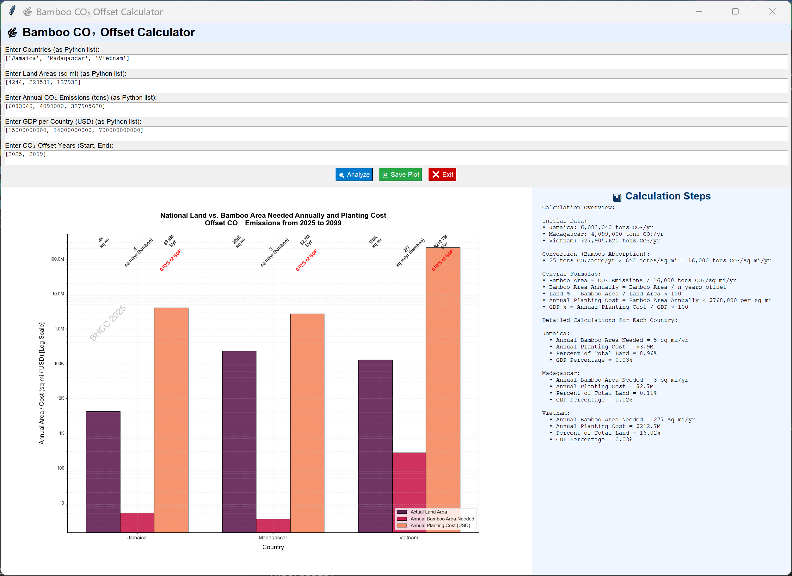

# 🎍 Bamboo CO₂ Offset Calculator

[](https://github.com/jentimanatol/BambooCO2OffsetCalculator/releases)
[](LICENSE)

> Created by **Anatolie Jentimir** – Designed for climate scientists, policymakers, educators, and environmental researchers.

**Bamboo CO₂ Offset Calculator** is a desktop tool built with **Python**, **Tkinter**, and **Matplotlib**, tailored to estimate and visualize the land required to offset a country’s CO₂ emissions using **high-efficiency bamboo plantations**.

This elegant app simplifies complex carbon sequestration math into interactive, intuitive visuals for comparative analysis. A must-have for green policy modeling and sustainability education.



---

## 🔽 Download

📦 Get the latest release here:  
➡️ **[Download v1.1 for Windows (.exe)](https://github.com/jentimanatol/BambooCO2OffsetCalculator/releases/download/v1.1/BambooCO2OffsetCalculator.exe)**

🕰️ Looking for earlier versions or source code?  
🔍 **[Browse all releases](https://github.com/jentimanatol/BambooCO2OffsetCalculator/releases)**

---

## 🌱 Features

- 📍 **Built-in Data**:
  - Preloaded CO₂ emission and land area stats for Jamaica, Madagascar, and Vietnam
  - Editable formulas and units included in-plot for educational clarity

- 📊 **Interactive Visualization**:
  - Grouped bar chart comparing each country’s actual land vs. bamboo area needed
  - Log-scale Y-axis for handling large variances in country size/emissions

- 🧮 **Mathematical Transparency**:
  - Annotated formulas for:
    - Bamboo sequestration rate per square mile
    - Emission-to-land conversion logic
    - Percent land coverage needed

- 💡 **Legend as Learning Tool**:
  - Custom LaTeX-styled legend showing detailed breakdowns for each country

- 💾 **Export & Share**:
  - Save high-resolution plot as `.jpg` for presentations, reports, or policy briefs

- 🎨 **Professional Look**:
  - Clean fonts, color palettes, and scientific formatting using `matplotlib`, `seaborn`, and LaTeX math styling

---

## 🧪 Perfect For:

- Climate science research
- Environmental policy studies
- Carbon offset feasibility analysis
- University and high school sustainability education
- Visual advocacy for green urban planning

---

## 🚀 How to Use

1. ✅ **Download** the `.exe` file from [Releases](https://github.com/jentimanatol/BambooCO2OffsetCalculator/releases).
2. ▶️ **Run** it on any Windows machine — no Python installation needed!
3. 📊 **View** the chart, study the math, and export your visual for further use.

---

## 💡 Behind the Calculation

Sequestration rate is assumed to be:

```
25 tons CO₂/acre/year × 640 acres/sq mi = 16,000 tons CO₂/sq mi/year
```

Each country’s required bamboo land is calculated as:

```
Bamboo Area (sq mi) = Annual CO₂ Emissions / 16,000
% of Land = (Bamboo Area / Total Land Area) × 100
```

These values are displayed in the plot for transparency and educational use.

---

## 📷 Example Output


---

## 🙌 Credits

Made with scientific curiosity and environmental passion by  
**[Anatolie Jentimir](https://github.com/jentimanatol)** — BHCC 2025 🌍

Special thanks to open-source libraries like **NumPy**, **Matplotlib**, and **Seaborn**, and the global climate data providers at [Worldometer](https://www.worldometers.info/co2-emissions/).

---

## ⭐ Show Your Support

If this tool helps you teach, learn, or advocate for carbon reduction,  
please consider ⭐ starring this repo on GitHub — it fuels future development!

---