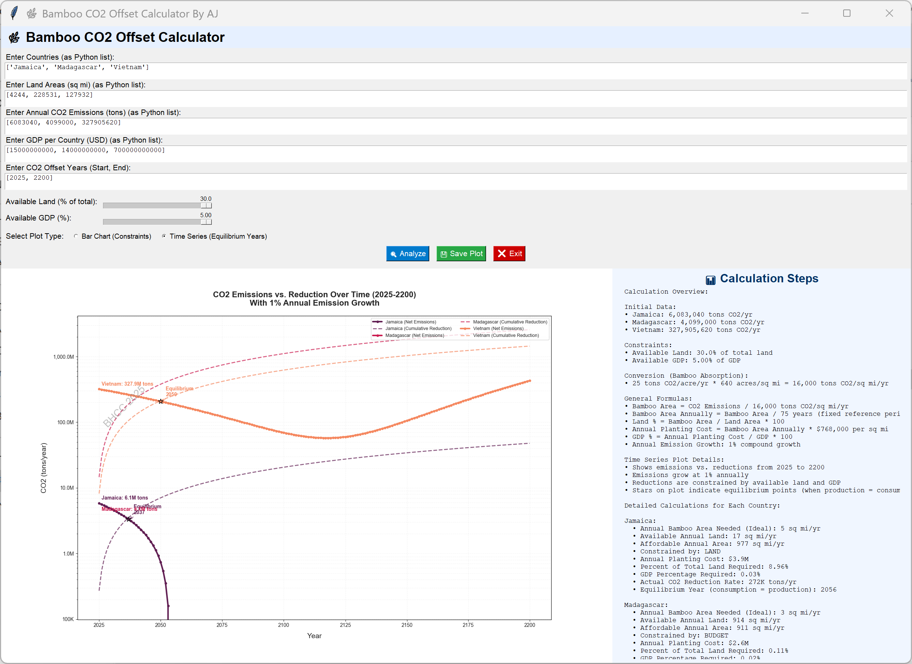

# 🎍 Bamboo CO₂ Offset Calculator

> Created by **Anatolie Jentimir** – Designed for climate scientists, policymakers, educators, and environmental researchers.

**Bamboo CO₂ Offset Calculator** is a desktop tool built with **Python**, **Tkinter**, and **Matplotlib**, tailored to estimate and visualize the land required to offset a country’s CO₂ emissions using **high-efficiency bamboo plantations**.

This elegant app simplifies complex carbon sequestration math into interactive, intuitive visuals for comparative analysis. A must-have for green policy modeling and sustainability education.

---

## 🔽 Download

📦 Get the latest release here:  
➡️ **[Download v3.1 for Windows (.exe)](https://github.com/jentimanatol/BambooCO2Offset/releases/download/v3.1/BambooCO2OffsetCalculator.exe)**

🕰️ Looking for earlier versions or source code?  
🔍 **[Browse all releases](https://github.com/jentimanatol/BambooCO2Offset/releases)**

---

## 🌱 Features

- 📍 **Built-in Data**:
  - Preloaded CO₂ emission and land area stats for Jamaica, Madagascar, and Vietnam
  - Editable formulas and units included in-plot for educational clarity

- 📊 **Interactive Visualization**:
  - Grouped bar chart comparing each country’s actual land vs. bamboo area needed
  - Log-scale Y-axis for handling large variances in country size/emissions

- 🧮 **Mathematical Transparency**:
  - Annotated formulas for:
    - Bamboo sequestration rate per square mile
    - Emission-to-land conversion logic
    - Percent land coverage needed
    - Annual planting cost and % of GDP

- 💡 **Legend as Learning Tool**:
  - Custom LaTeX-styled legend showing detailed breakdowns for each country

- 💾 **Export & Share**:
  - Save high-resolution plot as .jpg for presentations, reports, or policy briefs

- 🎨 **Professional Look**:
  - Clean fonts, color palettes, and scientific formatting using matplotlib, seaborn, and LaTeX math styling

---

## 🧪 Perfect For:

- Climate science research
- Environmental policy studies
- Carbon offset feasibility analysis
- University and high school sustainability education
- Visual advocacy for green urban planning

---

## 🚀 How to Use

1. ✅ **Download** the .exe file from [Releases](https://github.com/jentimanatol/BambooCO2Offset/releases).
2. ▶️ **Run** it on any Windows machine — no Python installation needed!
3. 📊 **View** the chart, study the math, and export your visual for further use.

---

## 💡 Behind the Calculation

### 📐 Core Formulas

- Bamboo sequestration rate per square mile per year:

  
- $$25 \text{ tons CO}_2/\text{acre}/\text{yr} \times 640 = 16000 \text{ tons CO}_2/\text{sq mi}/\text{yr}$$
  
- Bamboo area required (in sq mi):

- $$\\text{Bamboo Area} = \\frac{\\text{Annual CO}_2 \\text{ Emissions}}{16000}$$

- Annual bamboo area needed over N years (e.g., 75 years for 2025–2099):

- $$\\text{Bamboo Area per Year} = \\frac{\\text{Bamboo Area}}{N}$$

- Percentage of national land required:

- $$\\%\\text{Land} = \\left(\\frac{\\text{Bamboo Area}}{\\text{Total Land Area}}\\right) \\times 100$$

- Planting cost per year:

- $$\\text{Annual Cost} = \\text{Bamboo Area per Year} \\times 768000$$

- Percent of GDP required annually:

- $$\\%\\text{GDP} = \\left(\\frac{\\text{Annual Cost}}{\\text{GDP}}\\right) \\times 100$$

### 📊 Full Example — Vietnam

- CO₂ Emissions: 327,905,620 tons/year  
- Total Land Area: 127,932 sq mi  
- GDP: \$700,000,000,000 USD  
- Offset Period: 2025–2099 (75 years)

Step-by-step:

1. $$\\text{Bamboo Area} = \\frac{327,905,620}{16000} \\approx 20494.1 \\text{ sq mi}$$  
2. $$\\text{Bamboo Area per Year} = \\frac{20494.1}{75} \\approx 273.25 \\text{ sq mi/yr}$$  
3. $$\\%\\text{Land} = \\left(\\frac{20494.1}{127932}\\right) \\times 100 \\approx 16.02\\%$$  
4. $$\\text{Annual Cost} = 273.25 \\times 768000 \\approx \\$209,088,000$$  
5. $$\\%\\text{GDP} = \\left(\\frac{209088000}{700000000000}\\right) \\times 100 \\approx 0.03\\%$$

So Vietnam needs **~273.25 sq mi/year of bamboo**, **\$209M/year in planting costs**, and that equals **~0.03% of its GDP**.

---

## 📷 Example Output

---

## 🙌 Credits

Made with scientific curiosity and environmental passion by  
**[Anatolie Jentimir](https://github.com/jentimanatol)** — BHCC 2025 🌍

Special thanks to open-source libraries like **NumPy**, **Matplotlib**, and **Seaborn**, and the global climate data providers at [Worldometer](https://www.worldometers.info/co2-emissions/).

---

## ⭐ Show Your Support

If this tool helps you teach, learn, or advocate for carbon reduction,  
please consider ⭐ starring this repo on GitHub — it fuels future development!

